# Data Science Project
## Foreword
In this report, the perspective of an employee of a high street bank has been adopted. To maintain confidentiality, specific details have been masked (e.g. the name of the bank), and a publicly available dataset has been used for this proof-of-concept.
## Abstract (Executive Summary)
A proof-of-concept for the use of Natural Language Processing (NLP) to identify areas of products and services to improve from direct customer verbatim is provided by this project. The effectiveness of sentiment analysis (through basic lexicon scoring and using a pretrained Machine Learning (ML) model) and topic modelling (through training an ML model on these reviews) in identifying and surfacing particular positive and negative drivers of feedback is showcased. The effectiveness of these NLP techniques is illustrated by the proof-of-concept, and possible means of surfacing the insights to the end user are provided.
## Introduction
High street banks are increasing their digital presences (Williams, 2024, Emanuel-Burns, 2025) following the surge in profitability of digital ‘neo-banks’ over the Covid-19 pandemic (Onashabay, 2021), and their continuing to occupy a significant share of the banking market (Green, 2025). Digital services offer a unique opportunity to analyse customer experience, particularly because every interaction can create a digital record. However, observing how a customer uses their app is not indicative of that customer’s true sentiment. Surveys that use closed questions to feed Net Promoter Scores (NPS) for ‘outbound’ interactions (i.e. when the customer has left a journey) can therefore be used to gauge sentiment – however, this is limited to the answers that the survey writer provides when creating the survey.  
The Artificial Intelligence (AI) boom has rapidly accelerated in recent years, attributed to particular advancements in Large Language Model (LLM) technologies being accessible to consumers (including OpenAI’s ChatGPT, Microsoft’s Copilot, Google’s Gemini) (Griffith and Metz, 2023). This has resulted in AI stocks comprising 44% of the S&P 500 – representing an overwhelming share of the US market (Bank of England, 2025). However, AI is much more than LLMs and the chatbots that wrap these. The backbone of LLMs is Natural Language Processing (NLP), the field of AI that allows computers to understand human language – of which LLMs are just one type of model. Sentiment analysis and topic modelling are two other types of NLP, which involve creating a sentiment score and particular topics from text respectively.
The digitisation of banking journeys and rise in availability of NLP tools represents an opportunity for customer experience to better be understood so that these journeys can be improved, leading to both better customer experience and enhanced profitability for the bank. The use of sentiment analysis and topic modelling on a publicly available dataset of Amazon reviews is explored in this report.
### Hypotheses
#### Sentiment analysis
Null hypotheses: there is no statistically significant correlation between ‘true’ rating scores from user reviews and ‘predicted’ sentiment scores from sentiment analysis.
Alternative hypotheses: there is a statistically significant correlation between ‘true’ rating scores from user reviews and ‘predicted’ sentiment scores from sentiment analysis.
#### Topic modelling
Null hypothesis: wordclouds are able to surface topics in positive and negative reviews at an equivalent or greater rate than topic modelling techniques.
Alternative hypothesis: topic modelling techniques are superior at surfacing topics than wordclouds.
The above hypothesis are subjective, since there is no discernible method of determining which technique is superior in surfacing topics without contacting the merchant directly – which is unavailable for this project.
## Methodology (Data Infrastructure & Tools, Data Engineering, Data Analytics)
### Data Infrastructure & Tools
#### The dataset
There are many different datasets of customer reviews. Amazon was chosen as a source of reviews, since it is the biggest online retailer in the world, and thus the most representative sample of the population is captured – just as retail banks capture a representative sample of the population that they operate in. There are also many different datasets of customer reviews. The USCD database was chosen since it contains fields for product identifier, allowing the reviews to be aggregated on a product level, customer star rating, providing a ‘truth’ value for the sentiment of the review, and review text, containing the customer verbatim.
The dataset was sourced from the University of California San Diego’s (USCD) ‘Amazon Reviews 2023’ site (https://amazon-reviews-2023.github.io/). The ‘Office_Products’ dataset was chosen due to it being relatively, but not overwhelmingly, large. 
#### Data considerations
Ethical considerations of this data (and techniques) include the fact that, despite choosing Amazon for its representative population sample, analytical techniques are only conducted for English-language reviews. Also, spelling errors are not resolvable due to the volume of data and simpler nature of sentiment analysis techniques. Accordingly, sentiment analysis and topic modelling techniques will only work effectively from reviews by English speakers that are able to input their thoughts with correct spelling, meaning that this analysis will be biased against those that do not fit both categories. This cannot be resolved in this project, but remains an important consideration for outputs of this project and the forming of future projects.
As mentioned previously, this dataset is publicly available, designed to be open, so privacy and governance considerations do not have bearing on this project.
#### Tools
For this project, Python, and various libraries, was the main tool used. It has many different libraries for data loading, NLP and other ML processes, and data visualisation. Jupyter Lab was also used as a notebook tool and its browser-based Integrated Development Environment (IDE).
|Purpose|Import|Rationale|
|---|---|---|
|Data loading|json|The reviews dataset is stored in JSONL format|
|-|pandas|The industry standard for data manipulation|
|General processing|tqdm|Used for visualisation of code progress|
|-|IPython|To clear outputs (particularly progress bars)|
|NLP|re|For cleaning text|
|-|nltk|For its broad suite of NLP tools|
|-|afinn|For its lexicon scoring function|
|-|bertopic|For its topic modelling capabilities|
|Analysis|seaborn|The industry standards for their broad data visualisation and analysis capabilities|
|-|matplotlib|-|
|-|scikit_learn|-|
### Data Engineering
Significantly transformation of the reviews dataset was required before analytics could be performed.
#### Fields
In its raw form, the dataset contained many fields:
|Field|Datatype|Definition|
|---|---|---|
|rating|Float|Number of stars|
|title|String|Review title|
|text|String|Review body|
|images|List|Image files attributed to review|
|asin|String|Product variant identifier|
|parent_asin|String|Product identifier|
|user_id|String|Reviewer identifier|
|timestamp|Datetime|Timestamp of review|
|helpful_vote|Integer|Number of ‘helpful’ votes|
|verified_purchase|Bool|Whether purchase is verified|

The only required fields for this analysis were ‘rating’, for the ‘true’ user sentiment behind the review, the ‘asin’, so that reviews could be aggregated on a true product variant level, and the ‘text’ field, for the review text. The ‘parent_asin’ field was not used, since variants of the same product can be significantly different, and have different positive and negative drivers. This is in spite of the facts that all reviews for the different variants of a product are held on the page of the parent product and the mean rating of that product is comprised of all reviews, regardless of variant status.
#### Null handling
It was found that there were no nulls in the dataset, perhaps on account of due diligence by the dataset publisher.
#### Ratings
Since reviews with zero stars are not possible through Amazon, instances of these were removed from the dataset.
Reviews were then normalised around -1 to 1, with -1 representing the least number of stars (1), and 1 representing the greatest (5). This was done with the following formula: (original rating – 3) / 2. This was done to allow correlation to be calculated effectively.
Reviews were also classified, with 1-2 stars being classified as negative, 3 as neutral, and 4-5 as positive. This was done to allow confusion matrices to be created.
#### Text
Cleaning text in this project is kept distinct from the text preprocessing stage. This was because there were issues in the text that needed to be handled prior to techniques that preprocessing would normally refer to.
Reference to images in double square brackets, links to websites, and HTML references in chevrons were sometimes contained in the text. These were easily removed with regex operations. The resulting dataset was filtered for records with no alphabetical characters in the ‘text’ field – which comprised mainly of reviews of emojis, but also reviews that were left empty as a result of removing previously mentioned strings (i.e. image references/links/HTML references). 
#### Counts
Reviews for products with fewer than 10 reviews for each classification of rating (i.e. positive/neutral/negative) were dropped. This was to ensure that each product had a representative number of reviews, rather than some products only having one negative review.
#### Text preprocessing
Three fields were created as a result of text preprocessing, each of which building on the previous:
|Field|Source field|Operations on source|
|---|---|---|
|cleaned_text|text|Lowercase, removed non-alphabetical/whitespace|
|tokens|cleaned_text|nltk’s word_tokenize function|
|no_stopword_tokens|tokens|Remove English stopwords from nltk’s stopwords|
### Data Analytics
#### Sentiment analysis
There are two ways of performing sentiment analysis: lexicon based, and ML model based. Both were used independently in order for their accuracy on gauging sentiment from verbatim could be determined. The scores for both methods were generated from the ‘cleaned_text’ field of the remaining dataset since whole strings rather than tokens were handled by both.
Both techniques were assessed through the calculation of a Spearmen’s rank correlation coefficient and associated p value between the review’s respective score and its ‘true’ sentiment from its rating. Spearman’s rank was used since the rating data is ordinal. p values of below 0.05 were considered statistically significant.
The scores were also classified (as “Positive”/”Neutral”/”Negative”) according to the distribution of rating classifications across the dataset. These classifications allowed for the creation of confusion matrices to visualise each technique’s accuracy.
##### Lexicon scoring
For lexicon scoring, the AFINN function was chosen due it its prevalence in the NLP industry. Since it scores per word, and each score ranges from -5 (very negative word) to 5 (very positive word), the average AFINN score was calculated and normalised around -1 to 1. This was done with the following formula: (total AFINN score / number of words) / 5.
##### ML model scoring
For ML-based sentiment analysis, the VADER model was chosen. It is a pretrained model whose outputs include a ‘compound’ score that indicates the overall sentiment of the text, ranging between -1 (as extremely negative) and 1 (as extremely positive) – therefore no normalisation needs to be conducted.
#### Topic classification
For topic classification, BERTopic was used. It uses Google’s BERT transformer model to capture the contextual meaning behind words to draw the true topic of the text, rather than selecting topics based on frequency like Latent Dirichlet Allocation (LDA), a popular technique for topic classification.
Prior to classification, BERTopic was not trained; rather, automatic discovery of topics was allowed. This follows the intended outcome of this project, where trends that are potentially not known by the assessor can be surfaced.
Topic classification was performed on reviews for the most reviewed product, since different aspects will drive sentiment in different ways. For example, loudness will be a positive driver for a pair of headphones, but a negative driver for a paper shredder. These reviews will be split by positive and negative (from the ‘rating’ field), and topics drawn from each.
The model’s performance was assessed by comparing the topics identified to simple word clouds based on word frequency. 
## Results (Data Visualisation & Dashboards)
### General visualisations
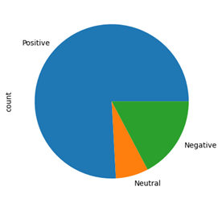

Figure 1 - Distribution of review classifications across dataset (visual)

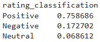

Figure 2 - Distribution of rating classifications across dataset (value)

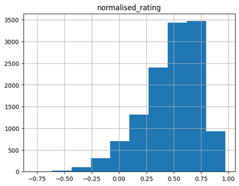

Figure 3 - Distribution of mean normalised rating per product variant
### Sentiment analysis
#### AFINN scoring
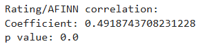

Figure 4 - Rating/AFINN score correlation

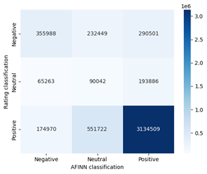

Figure 5 - Rating ('true') / AFINN ('predicted') classification confusion matrix
#### VADER scoring
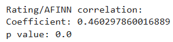

Figure 6 - Rating/VADER score correlation

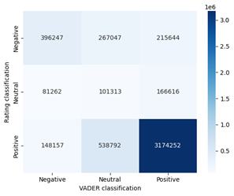

Figure 7 - Rating ('true') / VADER ('predicted') classification confusion matrix
### Topic modelling
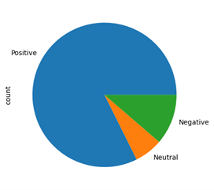

Figure 8 - Distribution of review classifications for chosen product
#### Positive reviews
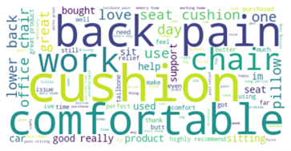

Figure 9 - Word cloud of positive reviews

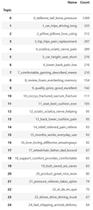

Figure 10 - Top 25 topics identified from positive reviews
#### Negative reviews
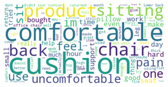

Figure 11 - Word cloud of negative reviews

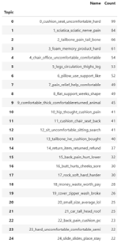

Figure 12 - Top 25 topics identified from negative reviews
## Discussion (Data Analytics)
### Sentiment analysis
Statistically significant positive correlations were observed for both methods of sentiment analysis. This enables the null hypothesis to be rejected, and alternative hypothesis to be accepted. However, misclassification, particularly in the ‘Negative’ and ‘Neutral’ rating classifications, is indicated by the confusion matrices. The reasons for this could be twofold: misclassification of the sentiments by the sentiment analysis techniques, or alternatively, that the review rating does not match the review text. However, there were far too many review to trawl this manually.
### Topic modelling
Topics that are a lot less visible in the wordcloud were surfaced by topic modelling of both the positive and negative review sets. For example, for the positive reviews, “memory foam” is very small in the wordcloud, despite being the 9th topic (BERTopic indexes from 0) identified by the model. Likewise, the first topic identified by the model in the negative reviews mentions “hard” – where it is certainly not the largest word in the wordcloud. A parallel is observed between the wordclouds, as both highlight generic words like “cushion” and “comfortable” are highlighted, providing little value to the interpreter. Accordingly, the null hypothesis has been rejected, and alternative hypothesis has been accepted.
## Conclusion
To conclude, both sentiment analysis and topic modelling could unlock significant opportunities in analysing customer experience verbatim, particularly where a sentiment score and distinct list of pain points is not provided by/to the customer. However, it is important to consider the limitations of freeformat text, particularly since those that are unable to engage with the input effectively may be those that struggle to engage with products and services themselves.
## Bibliography (Referencing and Academic Support)
Bank of England (2025) All chips in! Would a fall in AI-related asset valuations have financial stability consequences? Available at: https://www.bankofengland.co.uk/bank-overground/2025/all-chips-in-ai-related-asset-valuations-financial-stability-consequences (Accessed: 6th January 2026).
Emanuel-Burns, C (2025) Interview: Inside HSBC's major 18-month mobile banking app redesign. Fintech Futures. Available at: https://www.fintechfutures.com/digital-banking/interview-inside-hsbcs-major-18-month-mobile-banking-app-redesign (Accessed: 6th January 2026).
Green, C (2025) A tale of two cities – the rise and future of neobanks in the UK and US. RFI Global. Available at: https://rfi.global/a-tale-of-two-cities-the-rise-and-future-of-neobanks-in-the-uk-and-us/ (Accessed: 6th January 2026).
Griffith, E, and Metz, C (2023) A New Area of A.I. Booms, Even Amid the Tech Gloom. The New York Times. Available at: https://www.cise.ufl.edu/~arunava/Teaching/cap6610sp23/papers/A_New_Area_of_AI_Booms-NYT.pdf (Accessed: 6th January 2026).
Onashabay, N (2021) Effects of Covid-19 pandemic on the key profitability factors of digital challenger banks. Starling Bank case study (Doctoral dissertation, Central European University).
Williams, M (2024) Lloyds launches new campaign and design refresh. Creative Review. Available at: https://www.creativereview.co.uk/lloyds-design-branding-campaign/ (Accessed: 6th January 2026).
